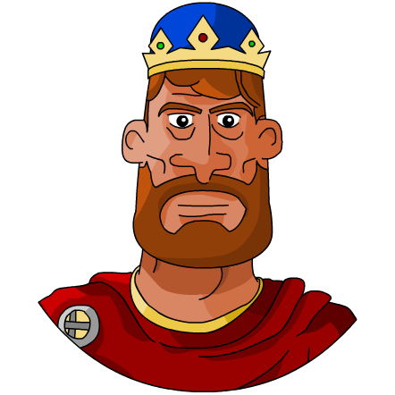

# repte5A_DANIEL_MIGALES
About Exercici del curs Introducció a la programació mobile (FS23-21) del SOC. PLA_5 Arrays.
Repte 5A :
El repte consisteix en un visualitzador dels 7 dels reis gots més èpics i llegendaris de tots els
temps, mostrant un a un la seva imatge, nom i regnat (valors guardats a l’ arrays).
En fer clic en un botó es mostra el següent rei.
Extra per millorar nota : En fer clic al botó també es guarda en un nou array el rei mostrat i
s’indica quants reis s’han guardat/visualitzats fins al moment.
Pots provar el repte totalment funcional i acabat (amb el codi javaScript ofuscat) amb aquest
enllaç: https://www.html6.es/curso/repte5a/
1. Descarrega i descomprimeix el fitxer: repte5A_ EL_TEU_NOM_COGNOM .rar
Substitueix el nom del fitxer html : repte5A_EL_TEU_NOM_COGNOM .html pel teu nom.
Obre amb el editor web el fitxer index .js de javaScript (ubicat a la carpeta js ) i afegeix el
codi necessari per realitzar les següents funcionalitats:
2. (Els fitxers HTML , CSS , JS , la seva vinculació i gran part de les funcionalitats d’aquest punt
ja estan creats).
Així, en obrir el fitxer html amb el navegador, inicialment es mostra la primera imatge de
l’array “personas” amb  , acompanyat del nom del personatge (indicata l’array “personas” ) en 
 i les dates del seu regnat (especificat a
l’array “fechas” ) en 
 . Tot mostrat dintre d’un primer 
 anomenat
“personalidad”.
Un <BUTTON> (funcionalitat explicada al punt 3).
Un segon 
 anomenat “invitados” (inicialment buit).
Un tercer 
 anomenat “cantidad” (on es mostra la quantitat de reis afegits fins al
moment, per això inicialment mostra 0, ja que encara no s’ha fet clic al botó).
Així, la teva feina en aquest punt 2 és inicialment ( tot amb javaScript ):
2a. Substituir la ruta de la imatge (src=”...”) de l’etiqueta  (línia 14) per
la imatge correcta (especificada al primer lloc [0] de l’array “personas” , afegint
l’extensió “.png” i anteposant la carpeta (img/) on estan les imatges) (amb javaScript
és clar) dintre de la funció inici .
2b. Actualitzar el text que existeix dintre del 
 anomenat “nombre” (línia 15) amb el
valor correcte especificat al primer lloc [0] de l’array “personas” , afegint al davant el
text “Rey” .
2c. Actualitzar el text que existeix dintre del 
 anomenat “reinado” (línia 16) amb el
valor correcte especificat al primer lloc [0] de l’array “fechas” .
3. En fer clic al <BUTTON>:
3a. Substituir la ruta de la imatge (src=”...”) de l’etiqueta  (línia 14) per
la següent imatge (especificada al lloc [que correspongui] de l’array “personas”
afegint l’extensió “.png” i anteposant la carpeta (img/) on estan les imatges).
3b. Es canvia el nom del rei al 
 anomenat “nombre” (línea 15) pel següent valor de
l’array “personas” .
3c. Es canvia els anys de regnat pel següent valor de l’array “fechas” al 
 anomenat
“reinado” (línea 16).
4. En fer clic al <BUTTON> i arribar al darrer valor de l’array:
4a. El primer 
 anomenat “personalidad” (on es mostren els valors dels arrays) i el
botó de la fletxa s’amaguen (canviant la seva propietat display:
document.querySelector… .style.display a “none” ).
Extra per millorar nota:
5. En fer clic al <BUTTON> :
(afegir les següents funcionalitats)
3d. La imatge  del personatge (anterior) s’afegeix al final del contingut del 

anomenat “invitados” amb una estructura semblant a:  ,
però utilitzant el valor correcte de l’array “personas” .
3e. S’afegeix aquest valor al final del nou array “reis_afegits” .
3f. Es consulta la quantitat de valors d’aquest array “ reis_afegits” i s’actualitza al 

anomenat “cantidad” (línia 25).
